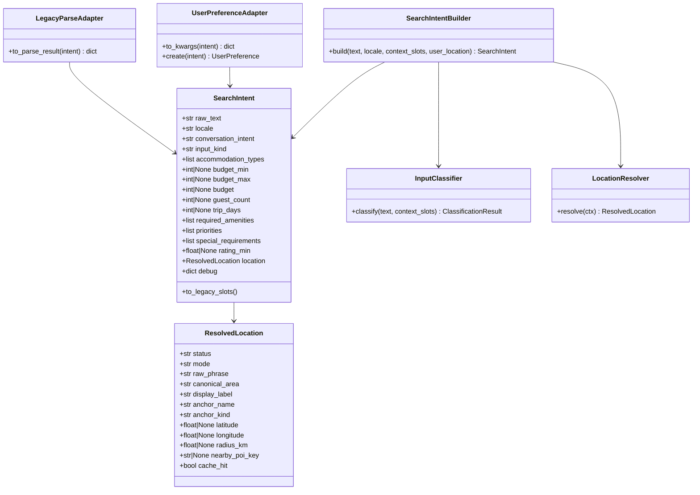
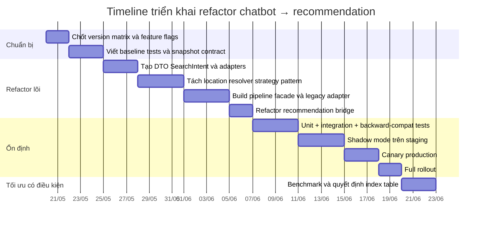

## Kiến trúc đích và layout module

Kiến trúc đích phù hợp nhất cho codebase này là: **giữ `parser_service.py` làm facade backward-compatible**, nhưng chuyển logic mới vào một package nhỏ, có ranh giới rõ ràng. Facade cũ vẫn expose `parse_user_text(...)` và vẫn trả JSON shape cũ cho `/api/chat/parse/` và `/api/chat/submit/`; bên trong, nó gọi pipeline mới để tạo `SearchIntent`, sau đó dùng adapter để sinh ra payload legacy và `UserPreference`. Cách này giúp bạn refactor từng phần mà không phải “đập đi làm lại” cả cây `chat_api`. Việc dùng dataclass làm DTO trung gian cũng giúp serialization và diff trong shadow mode dễ hơn. citeturn7view0turn1search1turn4view5

```mermaid
flowchart LR
    A[User text hoặc confirmed slots] --> B[input_classifier]
    B --> C[search_intent_builder]
    C --> D[location_resolver]
    D --> D1[PlaceReference cache]
    D --> D2[Nominatim geocode]
    D --> D3[Overpass POI resolve]
    C --> E[SearchIntent canonical DTO]
    E --> F[legacy-response adapter]
    E --> G[UserPreference adapter]
    F --> H[/api/chat/parse response cũ]
    G --> I[UserPreference]
    I --> J[recommendations/services.py]
    J --> K[bbox prefilter + haversine]
    K --> L[Recommendation result]
```



### Layout module đề xuất

Cấu trúc file nên ưu tiên **thêm mới** thay vì sửa sâu file cũ:

```text
chat_api/
  application/
    __init__.py
    chat_pipeline.py
    developer_checks.py
  nlu/
    __init__.py
    dto.py
    input_classifier_v2.py
    search_intent_builder.py
    legacy_slots_adapter.py
  location/
    __init__.py
    resolver.py
    context.py
    strategies/
      __init__.py
      base.py
      current_location.py
      direct_area.py
      near_anchor.py
      city_center.py
      selected_place.py
      fallback_geocode.py
      poi_centroid.py
  adapters/
    __init__.py
    search_intent_to_parse_result.py
    search_intent_to_user_preference.py
  management/
    commands/
      compare_chat_pipeline.py
      rebuild_accommodation_search_index.py
  tests/
    test_search_intent_dto.py
    test_input_classifier_v2.py
    test_location_resolver_v2.py
    test_user_preference_adapter.py
    test_legacy_parse_adapter.py
    test_pipeline_backward_compat.py
```

Nếu sau này cần tối ưu dữ liệu, bảng chuyển đổi riêng nên là:

```text
recommendations/
  models.py         # thêm AccommodationSearchIndex nếu thật sự cần
  management/
    commands/
      rebuild_accommodation_search_index.py
  tests/
    test_search_index.py
```

Django hỗ trợ viết custom management command bằng cách subclass `BaseCommand`, định nghĩa `add_arguments()` và `handle()`, đồng thời khuyến nghị dùng `self.stdout`/`self.stderr` để output cho dễ test. System check framework của Django cũng cho phép bạn thêm custom checks riêng, rất phù hợp để kiểm tra feature flag, config geocoder và readiness của pipeline mới. citeturn8view0turn8view1

### Bảng file cần thêm và sửa

| File/module | Hành động | Trách nhiệm chính | Input | Output | Effort | Priority |
|---|---|---|---|---|---|---|
| `chat_api/nlu/dto.py` | Thêm | Định nghĩa `SearchIntent`, `ResolvedLocation`, typed helpers | text đã chuẩn hóa, parsed slots | DTO canonical | Low | P0 |
| `chat_api/nlu/input_classifier_v2.py` | Thêm | Bọc classifier hiện tại dưới interface ổn định | `text`, `context_slots` | `ClassificationResult` | Low | P0 |
| `chat_api/location/resolver.py` | Thêm | Orchestrate strategy chain | `LocationContext` | `ResolvedLocation` | Med | P0 |
| `chat_api/location/strategies/*` | Thêm | Tách logic resolve theo trường hợp | `LocationContext` | partial/full `ResolvedLocation` | Med | P0 |
| `chat_api/nlu/search_intent_builder.py` | Thêm | Build `SearchIntent` từ classifier + extractor + resolver | `text`, `locale`, `context_slots`, `user_location` | `SearchIntent` | High | P0 |
| `chat_api/adapters/search_intent_to_parse_result.py` | Thêm | Sinh legacy parse result shape | `SearchIntent` | dict parse result cũ | High | P0 |
| `chat_api/adapters/search_intent_to_user_preference.py` | Thêm | Map `SearchIntent` sang `UserPreference` kwargs | `SearchIntent` | kwargs / model instance | High | P0 |
| `chat_api/application/chat_pipeline.py` | Thêm | Facade v2 + feature flags + shadow mode | request-level inputs | parse result legacy + telemetry | High | P0 |
| `chat_api/parser_service.py` | Sửa | Giữ API cũ nhưng delegate sang pipeline mới | `parse_user_text(...)` | response cũ | Med | P0 |
| `chat_api/recommendation_bridge.py` | Sửa | Cho phép create preference từ `SearchIntent` | parse result hoặc `SearchIntent` | `pref_id`, `recommendation_url` | Med | P0 |
| `chat_api/views.py` | Sửa nhẹ | Gọi facade v2, giữ endpoint contract | request JSON | JSON response | Low | P0 |
| `chat_api/services/place_cache.py` | Sửa nhẹ | Chuẩn hóa cache key cho geocode + POI centroid | query phrase | cached payload | Med | P1 |
| `recommendations/services.py` | Sửa cực ít | Chỉ thêm tolerance nếu có metadata mới | `UserPreference` | candidate/scores | Low | P1 |
| `recommendations/models.py` | Thêm có điều kiện | `AccommodationSearchIndex` nếu benchmark fail | core rows | denormalized index rows | Med | P2 |
| `chat_api/management/commands/compare_chat_pipeline.py` | Thêm | So sánh output v1/v2 trên sample conversations | file/cases | diff report | Low | P1 |
| `chat_api/management/commands/rebuild_accommodation_search_index.py` | Thêm có điều kiện | Backfill index table | accommodations | index rows | Med | P2 |

### Chữ ký class và hàm nên triển khai

```python
# chat_api/nlu/dto.py
from __future__ import annotations
from dataclasses import dataclass, field, asdict
from typing import Any, Literal

LocationMode = Literal[
    "unknown", "anywhere", "area", "near_anchor", "near_user",
    "city_center", "multiple_choice", "unsupported", "ambiguous"
]

@dataclass(slots=True, kw_only=True)
class ResolvedLocation:
    status: str
    mode: LocationMode = "unknown"
    raw_phrase: str | None = None
    canonical_area: str | None = None
    display_label: str | None = None
    anchor_name: str | None = None
    anchor_kind: str | None = None
    latitude: float | None = None
    longitude: float | None = None
    radius_km: float | None = None
    provider: str | None = None
    nearby_poi_key: str | None = None
    nearby_poi_label: str | None = None
    cache_hit: bool = False
    debug: dict[str, Any] = field(default_factory=dict)

    def to_dict(self) -> dict[str, Any]:
        return asdict(self)

@dataclass(slots=True, kw_only=True)
class SearchIntent:
    raw_text: str
    locale: str = "vi"
    conversation_intent: str = "recommend_accommodation"
    input_kind: str = "generic_text"

    area: str | None = None
    budget: int | None = None
    budget_min: int | None = None
    budget_max: int | None = None
    guest_count: int | None = None
    trip_days: int | None = None
    accommodation_types: list[str] = field(default_factory=list)
    required_amenities: list[str] = field(default_factory=list)
    priorities: list[str] = field(default_factory=list)
    special_requirements: list[str] = field(default_factory=list)
    rating_min: float | None = None

    location: ResolvedLocation = field(default_factory=lambda: ResolvedLocation(status="unresolved"))
    selected_place: dict[str, Any] | None = None
    user_location: dict[str, Any] | None = None

    confidence: float = 0.0
    assumptions: list[str] = field(default_factory=list)
    used_default_slots: dict[str, Any] = field(default_factory=dict)
    debug: dict[str, Any] = field(default_factory=dict)

    def to_dict(self) -> dict[str, Any]:
        return asdict(self)
```

```python
# chat_api/location/strategies/base.py
from __future__ import annotations
from dataclasses import dataclass
from typing import Protocol

from chat_api.nlu.dto import ResolvedLocation

@dataclass(slots=True)
class LocationContext:
    raw_text: str
    locale: str
    context_slots: dict
    selected_place: dict | None = None
    user_location: dict | None = None
    location_phrase: str | None = None
    mode_hint: str | None = None
    canonical_area_hint: str | None = None

class LocationResolverStrategy(Protocol):
    order: int
    def can_handle(self, ctx: LocationContext) -> bool: ...
    def resolve(self, ctx: LocationContext) -> ResolvedLocation: ...
```

```python
# chat_api/adapters/search_intent_to_user_preference.py
from __future__ import annotations
from typing import Any

from preferences.models import UserPreference
from chat_api.filter_tree import build_filter_tree, soft_filter_summary
from chat_api.nlu.dto import SearchIntent

DEFAULT_NEARBY_RADIUS_KM = 10.0

def search_intent_to_legacy_slots(intent: SearchIntent) -> dict[str, Any]:
    location = intent.location
    slots = {
        "area": intent.area,
        "budget": intent.budget,
        "budget_min": intent.budget_min,
        "budget_max": intent.budget_max or intent.budget,
        "guest_count": intent.guest_count,
        "trip_days": intent.trip_days,
        "required_amenities": intent.required_amenities,
        "priorities": intent.priorities,
        "special_requirements": intent.special_requirements,
        "accommodation_types": intent.accommodation_types,
        "rating": intent.rating_min,
        "location_mode": location.mode,
        "location_phrase": location.raw_phrase,
    }
    if intent.user_location:
        slots["user_location"] = intent.user_location
        slots["use_current_location"] = True
    return slots

def search_intent_to_location_result(intent: SearchIntent) -> dict[str, Any]:
    loc = intent.location
    return {
        "location_status": loc.status,
        "location_mode": loc.mode,
        "canonical_area": loc.canonical_area,
        "location_phrase": loc.raw_phrase,
        "location_display_label": loc.display_label,
        "anchor_name": loc.anchor_name,
        "anchor_kind": loc.anchor_kind,
        "anchor_lat": loc.latitude,
        "anchor_lon": loc.longitude,
        "anchor_radius_km": loc.radius_km,
        "provider": loc.provider,
        "cache_hit": loc.cache_hit,
        "nearby_poi_key": loc.nearby_poi_key,
        "nearby_place": loc.nearby_poi_label,
    }

def build_user_preference_kwargs(intent: SearchIntent) -> dict[str, Any]:
    slots = search_intent_to_legacy_slots(intent)
    location_result = search_intent_to_location_result(intent)
    tree = build_filter_tree(
        text=intent.raw_text,
        slots=slots,
        location_result=location_result,
    ).to_dict()

    area = None if intent.location.mode in {"near_anchor", "near_user", "anywhere"} else intent.area
    preferred_type = intent.accommodation_types[0] if len(intent.accommodation_types) == 1 else None
    lat = intent.location.latitude or (intent.user_location or {}).get("lat")
    lon = intent.location.longitude or (intent.user_location or {}).get("lon")
    radius = intent.location.radius_km or (intent.user_location or {}).get("radius_km") or DEFAULT_NEARBY_RADIUS_KM

    return {
        "area": area,
        "budget": intent.budget or intent.budget_max or 0,
        "guest_count": intent.guest_count or 1,
        "preferred_type": preferred_type,
        "required_amenities": intent.required_amenities,
        "location_mode": intent.location.mode,
        "location_label": intent.location.display_label or intent.location.anchor_name or intent.area,
        "anchor_kind": intent.location.anchor_kind,
        "filter_tree_json": tree,
        "soft_filter_summary": soft_filter_summary(tree),
        "user_latitude": lat,
        "user_longitude": lon,
        "search_radius_km": radius,
    }

def create_user_preference(intent: SearchIntent) -> UserPreference:
    return UserPreference.objects.create(**build_user_preference_kwargs(intent))
```

### Quy tắc dùng PlaceReference

`PlaceReference` nên là cache trung tâm cho **ba kiểu resolve**: địa điểm cụ thể, địa chỉ geocoded, và POI centroid theo khu vực. Nominatim hỗ trợ cả query free-form và structured; structured query phù hợp hơn cho address resolver, còn free-form hợp với landmark/POI phrase. Đồng thời Nominatim cũng nói rõ rằng special phrases không phù hợp để lấy “toàn bộ POI của một loại trong khu vực”; trường hợp đó phải dùng Overpass. Vì vậy strategy nên phân tách rành: **address → structured geocode**, **landmark/place → free-form geocode**, **POI category in area → Overpass centroid và cache lại vào PlaceReference**. citeturn4view1turn4view0turn4view2

## Kế hoạch triển khai theo bước

### Các bước triển khai khuyến nghị

Bước mở màn là **preflight stabilization**. Claude nên đồng bộ phiên bản Django thực dùng, chốt feature flags, và thêm test baseline trước khi đụng logic. Ít nhất cần có: `CHAT_PIPELINE_V2_ENABLED`, `CHAT_PIPELINE_V2_SHADOW_MODE`, `CHAT_PIPELINE_V2_COMPARE_LOG`, `CHAT_SEARCH_INDEX_ENABLED`. Đồng thời thêm custom system checks để fail fast khi dùng Nominatim public mà không có `User-Agent`, khi `DEBUG=True` ở production settings, hoặc khi bật v2 mà thiếu config bắt buộc. Django có system check framework extensible chính cho kiểu guardrail này. citeturn8view1turn4view8

Sau đó là **introduce DTO before behavior change**. Bạn đừng refactor parser trước; hãy tạo `SearchIntent` và `ResolvedLocation` trước, cùng hai adapter: adapter sang legacy parse result và adapter sang `UserPreference`. Đây là điểm mấu chốt để mọi phần sau có “đích đến chung”. Khi DTO đã có, pipeline mới có thể thay đổi bên trong mà không buộc recommendation layer biết chuyện gì xảy ra ở chatbot. `dataclasses` là lựa chọn hợp lý vì cho sẵn constructor, field typing và `asdict()`. citeturn7view0

Tiếp theo là **refactor location resolution thành strategy chain**. Thứ tự đề xuất là: current location → selected place → explicit area → city center → near-anchor/local cache → Nominatim fallback → POI centroid resolver → unresolved/ambiguous guard. Ở đây, điều quan trọng không phải là “tách cho đẹp”, mà là mỗi strategy có thể test riêng, benchmark riêng, và bật/tắt theo feature flag. Đặc biệt, vì Nominatim public có rate-limit rất thấp, cache phải được hỏi **trước** khi geocoder gọi ra ngoài. citeturn4view0turn4view1

Kế đến là **builder hóa pipeline**: `SearchIntentBuilder.build()` nên là nơi duy nhất ghép classifier, slot extraction, location resolution, defaults, assumptions và confidence. Nó không được create DB record, không được sinh HTTP response, không được gọi recommendation trực tiếp. `parse_user_text()` chỉ nên gọi builder, rồi dùng legacy adapter để phát ra payload cũ. Đây là chỗ bạn “đổi ruột mà không đổi vỏ”.

Bước tiếp là **bridge refactor**. `create_preference_from_parse()` nên được giữ lại để không vỡ code cũ, nhưng bên trong đổi thành:

- nếu có `search_intent_v2` trong parse result: dùng `UserPreferenceAdapter`;
- nếu không có: fallback sang logic cũ.

Như vậy, frontend và endpoint `/api/chat/submit/` vẫn không đổi contract, nhưng backend đã có đường migration dần.

Sau cùng là **staged rollout**. Ở dev, v2 chạy thật. Ở staging, bật shadow mode để chạy v1 và v2 song song, log diff và chỉ trả v1 cho client. Ở prod, canary tỷ lệ nhỏ rồi mới full cutover. Django test runner mặc định sẽ tạo test database, chạy migrate, chạy system checks trước khi chạy test suite; production deploy checklist của Django cũng yêu cầu dùng `check --deploy` và không dùng `runserver` cho production. citeturn8view2turn4view8



### Migration và backward-compatibility

Ở phase đầu, **không nên có migration schema cho core tables**. Nếu bạn làm đúng thiết kế, refactor chatbot chỉ là thêm module mới và sửa wiring. Điều này giúp giảm rủi ro rollback gần như tuyệt đối.

Nếu benchmark sau rollout cho thấy cần tăng tốc, mới thêm migration **riêng** cho `AccommodationSearchIndex`. Khi đó nên dùng migration có kiểm soát, và nếu cần backfill thì viết `RunPython` tách riêng; Django hỗ trợ rõ cho data migration, kể cả trường hợp multi-database. Nếu cần nạp dữ liệu seed/index vào test DB thì data migrations sẽ tự chạy khi test DB được tạo. citeturn4view6turn4view7turn8view2

Backward-compatibility checklist tối thiểu:

- `parse_user_text(text, locale="vi", context_slots=None, include_debug=None)` **không đổi signature**.
- `/api/chat/parse/` và `/api/chat/submit/` **không đổi shape response bắt buộc**.
- `recommendation_bridge.create_preference_from_parse()` **không bị xóa**.
- `recommendations/services.py` vẫn đọc `UserPreference` và `filter_tree_json` như cũ.
- `location_mode`, `search_origin`, `recommendation_action`, `created_preference`, `pref_id`, `recommendation_url` vẫn giữ semantics cũ.
- Nếu v2 thất bại, fallback sang v1 trong cùng request.

## Prompt triển khai cho Claude

### Prompt tổng điều phối

```text
Bạn đang làm việc trên codebase Django hiện có và phải refactor integration chatbot → recommendation theo nguyên tắc production-safe.

Mục tiêu:
- Giữ nguyên schema DB lõi và model hiện có: Accommodation, UserPreference, PlaceReference.
- Không thay search hiện tại trong recommendations/services.py: vẫn dùng bbox + haversine.
- Chỉ refactor phần chatbot và lớp bridge sang recommendation.
- Triển khai SearchIntent dataclass làm canonical DTO.
- Triển khai pipeline NLU gồm: input_classifier, search_intent_builder, location_resolver theo strategy pattern, adapter sang UserPreference.
- Dùng PlaceReference làm cache cho geocoding và POI resolution.
- Nếu cần tối ưu hiệu năng bằng data structure mới, chỉ được thêm bảng/index chuyển đổi riêng như AccommodationSearchIndex; tuyệt đối không sửa bảng lõi nếu chưa thật cần.

Ràng buộc:
- Phải giữ backward compatibility cho parse_user_text(), /api/chat/parse/, /api/chat/submit/, create_preference_from_parse().
- Refactor theo kiểu strangler pattern: thêm lớp mới, sau đó chuyển facade cũ sang gọi lớp mới.
- Mọi thay đổi phải có test.
- Phải thêm feature flags:
  - CHAT_PIPELINE_V2_ENABLED
  - CHAT_PIPELINE_V2_SHADOW_MODE
  - CHAT_PIPELINE_V2_COMPARE_LOG
  - CHAT_SEARCH_INDEX_ENABLED

Kết quả mong muốn:
- parse_user_text() trả response shape cũ, nhưng bên trong dùng SearchIntent pipeline mới.
- recommendation bridge có thể tạo UserPreference từ SearchIntent.
- Không làm vỡ recommendations/services.py hiện tại.
- Có unit test, integration test, backward compatibility test, và rollout notes.

Hãy thực hiện theo thứ tự:
1) Scan code liên quan và liệt kê public contracts cần giữ nguyên.
2) Tạo DTO và interfaces mới.
3) Tạo location resolver strategy chain.
4) Tạo SearchIntentBuilder.
5) Tạo adapters: SearchIntent -> legacy parse result, SearchIntent -> UserPreference.
6) Sửa parser_service.py để làm facade sang pipeline mới.
7) Sửa recommendation_bridge.py để hỗ trợ SearchIntent.
8) Viết test.
9) In ra diff tóm tắt cuối cùng và checklist manual verification.
```

### Prompt tạo DTO và pipeline skeleton

```text
Hãy triển khai skeleton cho pipeline mới mà chưa đổi behavior runtime:

Yêu cầu:
- Tạo file:
  - chat_api/nlu/dto.py
  - chat_api/location/strategies/base.py
  - chat_api/location/resolver.py
  - chat_api/nlu/search_intent_builder.py
  - chat_api/adapters/search_intent_to_parse_result.py
  - chat_api/adapters/search_intent_to_user_preference.py
  - chat_api/application/chat_pipeline.py
- Dùng dataclass(slots=True, kw_only=True) cho SearchIntent và ResolvedLocation.
- Thêm typing đầy đủ.
- Chưa xóa hoặc ghi đè logic cũ.
- Tạo TODO rõ ràng ở các điểm chưa map hết behavior.
- Đảm bảo import không tạo circular dependency.

Việc cần làm cụ thể:
- SearchIntent phải chứa: raw_text, locale, conversation_intent, input_kind, area, budget, budget_min, budget_max, guest_count, trip_days, accommodation_types, required_amenities, priorities, special_requirements, rating_min, selected_place, user_location, location, confidence, assumptions, used_default_slots, debug.
- ResolvedLocation phải chứa: status, mode, raw_phrase, canonical_area, display_label, anchor_name, anchor_kind, latitude, longitude, radius_km, provider, nearby_poi_key, nearby_poi_label, cache_hit, debug.
- Tạo interface LocationResolverStrategy và LocationContext.
- Tạo ChatPipeline class với method parse_text(...)->dict và build_search_intent(...)->SearchIntent.
- Chưa nối vào parser_service, nhưng code phải chạy import được.

Sau khi xong:
- Hiển thị tree file đã thêm.
- Hiển thị chữ ký class/hàm chính.
```

### Prompt nối behavior thật nhưng giữ contract cũ

```text
Hãy nối pipeline mới vào behavior runtime mà vẫn giữ contract cũ.

Yêu cầu:
- parser_service.parse_user_text() phải giữ nguyên signature.
- parser_service.parse_user_text() gọi ChatPipeline trước, rồi dùng adapter để trả response legacy.
- Nếu pipeline mới raise exception, fallback sang parse_user_text_rule_based() cũ.
- response cuối vẫn phải có các key hiện tại mà frontend đang dùng.
- parse_result legacy phải chứa thêm field search_intent_v2 ở dạng dict để bridge có thể dùng, nhưng không được làm vỡ client.
- create_preference_from_parse() trong recommendation_bridge.py phải ưu tiên đọc search_intent_v2 nếu có.
- Tuyệt đối không đổi endpoint URL hoặc tên view.

Yêu cầu kỹ thuật:
- Viết helper chuyển SearchIntent -> legacy slots.
- Tái sử dụng build_filter_tree(...) hiện có để sinh filter_tree_json thay vì viết mới logic recommendation filter.
- Giữ logic search_origin tương thích.
- location_mode và anchor fields phải map theo semantics cũ.

Sau khi xong:
- In ra danh sách file đã sửa.
- In các điểm backward compatibility đã giữ.
- In mọi TODO còn mở.
```

### Prompt triển khai strategy pattern cho location resolver

```text
Hãy refactor resolve location thành strategy pattern và ưu tiên cache.

Yêu cầu:
- Tạo strategies tối thiểu:
  - CurrentLocationStrategy
  - SelectedPlaceStrategy
  - DirectAreaStrategy
  - CityCenterStrategy
  - NearAnchorFromReferenceStrategy
  - FallbackGeocodeStrategy
  - PoiCentroidStrategy
  - AmbiguousOrUnsupportedStrategy
- Resolver phải chạy theo thứ tự order.
- PlaceReference phải được hỏi trước khi gọi geocoder ngoài.
- Với address-like input, ưu tiên query structured nếu có thể.
- Với landmark/place phrase, dùng free-form geocode.
- Với nearby POI + area, resolve area trước, rồi gọi Overpass centroid, sau đó cache kết quả vào PlaceReference.
- Nếu external resolve fail, trả unresolved/ambiguous hợp lệ, không throw.

Bắt buộc:
- Có rate-limit guard và timeout config points cho geocoder.
- Có debug metadata để staging shadow mode so sánh được.
- Có unit tests cho từng strategy và resolver order.
```

### Prompt viết test, shadow mode và rollout command

```text
Hãy thêm test và tooling cho rollout an toàn.

Yêu cầu:
- Tạo test files:
  - chat_api/tests/test_search_intent_dto.py
  - chat_api/tests/test_location_resolver_v2.py
  - chat_api/tests/test_user_preference_adapter.py
  - chat_api/tests/test_pipeline_backward_compat.py
  - recommendations/tests/test_recommendation_bridge_v2.py
- Dùng:
  - SimpleTestCase cho pure DTO / pure mapping
  - TestCase cho DB tests
  - TransactionTestCase chỉ khi thật cần transaction behavior
- Thêm management command compare_chat_pipeline để chạy một tập câu mẫu qua v1/v2 và in diff.
- Nếu thêm AccommodationSearchIndex thì tạo thêm management command rebuild_accommodation_search_index.

Checklist test tối thiểu:
- shape response parse không đổi
- submit vẫn tạo UserPreference đúng
- near_anchor vẫn dùng bbox + haversine downstream
- area mode, near_user mode, city_center mode và nearby_poi mode đều map đúng
- cache hit từ PlaceReference không gọi external geocoder
- pipeline mới lỗi thì fallback v1

Sau khi xong:
- In lệnh test cần chạy.
- In lệnh compare cần chạy trên staging.
- In checklist prod rollout.
```

## Kiểm thử, mẫu dữ liệu và hiệu năng

### Bộ test khuyến nghị

Django khuyến nghị `TestCase` cho phần lớn test có DB vì nó dùng transaction rollback để tăng tốc; còn `TransactionTestCase` chỉ nên dùng khi bạn cần quan sát commit/rollback thật. Test runner mặc định của Django khi chạy `manage.py test` sẽ tạo test DB, chạy `migrate`, nạp initial data từ migrations, chạy system checks rồi mới chạy test suite. Vì vậy kế hoạch test tốt nhất ở đây là chia rõ pure unit test và integration test theo đúng lớp. citeturn4view5turn8view2

| Nhóm test | Nên dùng | Mục tiêu |
|---|---|---|
| DTO / mapper thuần | `SimpleTestCase` | test `SearchIntent`, default values, serialization, mapping |
| Resolver / adapter có DB | `TestCase` | test `PlaceReference` cache, create `UserPreference`, legacy payload |
| Endpoint parse/submit | `TestCase` + Django test client | đảm bảo contract cũ không đổi |
| Management command | `TestCase` | test `compare_chat_pipeline`, `rebuild_accommodation_search_index` |
| Transaction-sensitive | `TransactionTestCase` | chỉ dùng nếu có batch backfill/index rebuild cần kiểm tra commit thật |

### Test case mẫu nên có

```python
from django.test import SimpleTestCase, TestCase
from chat_api.nlu.dto import SearchIntent, ResolvedLocation
from chat_api.adapters.search_intent_to_user_preference import build_user_preference_kwargs
from chat_api.models import PlaceReference

class SearchIntentDtoTests(SimpleTestCase):
    def test_search_intent_defaults_are_safe(self):
        intent = SearchIntent(raw_text="khách sạn quận 1")
        self.assertEqual(intent.locale, "vi")
        self.assertEqual(intent.accommodation_types, [])
        self.assertEqual(intent.location.status, "unresolved")

class UserPreferenceAdapterTests(TestCase):
    def test_area_mode_maps_without_coordinates(self):
        intent = SearchIntent(
            raw_text="homestay quận 1 dưới 800k cho 2 người",
            area="Quận 1",
            budget=800_000,
            guest_count=2,
            accommodation_types=["homestay"],
            location=ResolvedLocation(
                status="ok",
                mode="area",
                canonical_area="Quận 1",
                display_label="Quận 1",
            ),
        )
        kwargs = build_user_preference_kwargs(intent)
        self.assertEqual(kwargs["area"], "Quận 1")
        self.assertEqual(kwargs["location_mode"], "area")
        self.assertIsNone(kwargs["user_latitude"])
        self.assertIsNone(kwargs["user_longitude"])

    def test_near_anchor_maps_to_coordinates(self):
        intent = SearchIntent(
            raw_text="gần Nhà thờ Đức Bà cho 2 người",
            guest_count=2,
            location=ResolvedLocation(
                status="ok",
                mode="near_anchor",
                raw_phrase="Nhà thờ Đức Bà",
                anchor_name="Nhà thờ Đức Bà",
                anchor_kind="landmark",
                latitude=10.7798,
                longitude=106.6990,
                radius_km=2.5,
                display_label="gần Nhà thờ Đức Bà",
            ),
        )
        kwargs = build_user_preference_kwargs(intent)
        self.assertIsNone(kwargs["area"])
        self.assertEqual(kwargs["location_mode"], "near_anchor")
        self.assertEqual(kwargs["user_latitude"], 10.7798)
        self.assertEqual(kwargs["search_radius_km"], 2.5)

class PlaceReferenceCacheTests(TestCase):
    def test_cache_hit_skips_external_geocoder(self):
        PlaceReference.objects.create(
            query_text="nha tho duc ba",
            normalized_query="nha tho duc ba",
            canonical_name="Nhà thờ Đức Bà",
            normalized_name="nha tho duc ba",
            aliases=["duc ba", "nha tho duc ba"],
            kind="landmark",
            latitude=10.7798,
            longitude=106.6990,
            default_radius_km=2.5,
            provider="osm",
            source="cache",
            confidence=0.95,
        )
        # gọi resolver/ pipeline ở đây và assert geocoder mock không bị gọi
```

### Mẫu hội thoại và kỳ vọng SearchIntent → UserPreference

| Input hội thoại | SearchIntent kỳ vọng | UserPreference kỳ vọng |
|---|---|---|
| `Khách sạn gần Nhà thờ Đức Bà cho 2 người, tối đa 1tr2, có wifi` | `location.mode="near_anchor"`, `anchor_name="Nhà thờ Đức Bà"`, `budget=1200000`, `guest_count=2`, `required_amenities=["wifi"]`, `accommodation_types=["hotel"]` | `area=None`, `location_mode="near_anchor"`, `location_label="gần Nhà thờ Đức Bà"`, `user_latitude/user_longitude` có giá trị, `search_radius_km≈2.5-5.0` |
| `Homestay ở Quận 1 800k cho 3 người` | `location.mode="area"`, `area="Quận 1"`, `budget=800000`, `guest_count=3`, `accommodation_types=["homestay"]` | `area="Quận 1"`, `location_mode="area"`, không có tọa độ anchor |
| `Gần tôi, căn hộ có bếp cho 2 người` + browser geolocation | `location.mode="near_user"`, `user_location` có lat/lon, `required_amenities=["kitchen"]`, `accommodation_types=["apartment"]` | `area=None`, `location_mode="near_user"`, `location_label="Gần vị trí hiện tại"`, có `user_latitude/user_longitude` |
| `Tìm chỗ ở gần cafe ở Phú Nhuận dưới 900k` | ban đầu `area="Phú Nhuận"`, `nearby_poi_key="cafe"`; nếu centroid resolve thành công thì nâng lên `location.mode="near_anchor"` với centroid cached | nếu centroid ok: `location_mode="near_anchor"`; nếu không: `location_mode="area"` + `filter_tree_json.location.nearby_poi_key="cafe"` |
| `Ở đâu cũng được, miễn dưới 700k` | `location.mode="anywhere"`, `budget=700000` | `area=None`, `location_mode="anywhere"`, không có anchor lat/lon |

### Tiêu chí hiệu năng và ngưỡng nâng cấp dữ liệu

Do DB size thật, query mix thật và traffic production của bạn hiện **chưa được chỉ rõ**, tôi không xem các ngưỡng dưới đây là “sự thật tuyệt đối”, mà xem là **threshold vận hành đề xuất** để ra quyết định. Về mặt kỹ thuật, PostGIS mạnh vì spatial index giúp tránh sequential scan và dùng mô hình bounding-box prefilter trước khi exact check; đó cũng chính là cùng một nguyên lý mà bbox + haversine hiện tại đang mô phỏng thủ công. Nếu về sau cần spatial DB thực thụ, PostGIS/GeoDjango là hướng tự nhiên hơn SQL Server third-party backend cho các bài toán hình học phức tạp. citeturn5view0turn5view1turn5view2turn4view3

| Chỉ số | Mục tiêu phase hiện tại | Nếu vượt ngưỡng | Hành động |
|---|---|---|---|
| Parse latency p95 không geocode | `< 150ms` | > 250ms | profile extractor/classifier, cache normalize, cắt debug payload |
| Parse latency p95 có geocode | `< 1200ms` | > 1800ms | tăng cache hit, rate limit tốt hơn, giảm số query variants |
| Tỷ lệ cache hit PlaceReference | `> 60%` với repeated place queries | < 30% | chuẩn hóa alias tốt hơn, cache thêm POI centroid |
| Số row còn lại sau bbox prefilter | `< 10%` tổng bảng cho nearby queries | > 25% | cân nhắc `AccommodationSearchIndex` |
| Haversine calculations / request | `< 300` trung bình | > 1000 | index table hoặc tốt hơn là precomputed tiles/buckets |
| Nearby recommendation p95 | `< 300ms` ở 10k rows | > 500ms | thêm `AccommodationSearchIndex` |
| Kích thước accommodation | `<= 10k` | 10k–100k | phase 2: thêm bảng index chuyển đổi |
| Nhu cầu spatial join/polygon thực | thấp hoặc chưa có | tăng rõ | phase 3: cân nhắc PostGIS/GeoDjango |

### Khi nào nên thêm `AccommodationSearchIndex`

Chỉ thêm bảng này nếu một trong ba điều kiện xảy ra:

- dữ liệu accommodation vượt khoảng **10.000–20.000 rows** và query nearby bắt đầu chậm rõ;
- số record lọt qua bbox prefilter vẫn quá lớn nên haversine exact check tốn CPU;
- bạn cần thêm precomputed tokens/normalized fields để search mềm nhưng không muốn đụng `Accommodation`.

Thiết kế gợi ý:

```python
class AccommodationSearchIndex(models.Model):
    accommodation = models.OneToOneField(
        "accommodations.Accommodation",
        on_delete=models.CASCADE,
        primary_key=True,
        related_name="search_index",
    )
    area_normalized = models.CharField(max_length=120, db_index=True)
    accommodation_type = models.CharField(max_length=20, db_index=True)
    latitude = models.FloatField(db_index=True)
    longitude = models.FloatField(db_index=True)
    capacity = models.IntegerField(db_index=True)
    price_per_night = models.IntegerField(db_index=True)
    amenities_text = models.TextField(blank=True)
    updated_at = models.DateTimeField(auto_now=True)
```

Lúc đó `recommendations/services.py` vẫn có thể giữ bbox + haversine, chỉ đổi “bảng đầu vào” từ `Accommodation` sang `AccommodationSearchIndex` rồi join lại `Accommodation` khi cần render.

## Giả định, rủi ro mở và nguồn

### Giả định đã dùng

Những giả định dưới đây **không có dữ liệu xác nhận trong yêu cầu**, nên tôi đánh dấu rõ để bạn hoặc Claude agent xử lý theo nhánh điều kiện:

- Kích thước DB production, throughput/chat volume, concurrency và SLO hiện tại là **unspecified**.
- Snapshot code gửi lên là đại diện hợp lý cho production flow, nhưng có thể chưa phản ánh toàn bộ infra deploy.
- Frontend hiện đang phụ thuộc vào shape response của `/api/chat/parse/` và `/api/chat/submit/`.
- `recommendations/services.py` phải được giữ làm engine downstream chính.
- Có thể chấp nhận thêm file/module mới trong `chat_api` và sửa wiring nhẹ ở `views.py`, `parser_service.py`, `recommendation_bridge.py`.
- Nếu dùng public Nominatim/Overpass ở production, hệ thống phải chấp nhận cache-first và khả năng đổi provider sau này. citeturn4view0turn4view2

### Rủi ro mở

Rủi ro kỹ thuật lớn nhất không phải ở DTO hay adapter, mà ở **parity giữa parse result cũ và parse result mới**. Nếu không có shadow mode và diff tooling, bạn rất dễ “đúng kiến trúc nhưng sai hành vi”. Rủi ro thứ hai là **dependency drift** giữa phiên bản Django/runtime/package thực tế. Rủi ro thứ ba là **geocoder public quota**: nếu resolver mới vô tình tăng số lần gọi external provider, hệ thống có thể ổn ở local nhưng fail ở staging/prod. Những rủi ro này đều xử lý được nếu bạn rollout theo dev → staging shadow → prod canary, có logs diff và KPI rõ ràng. citeturn4view0turn4view2turn4view8